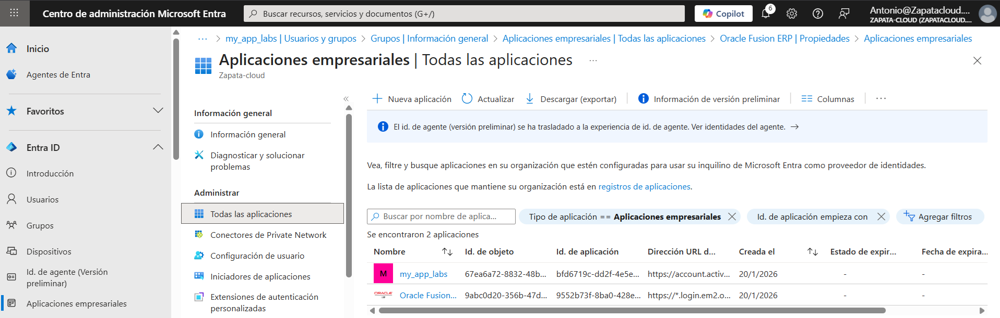
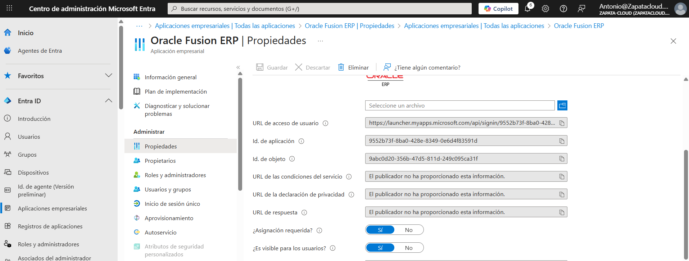
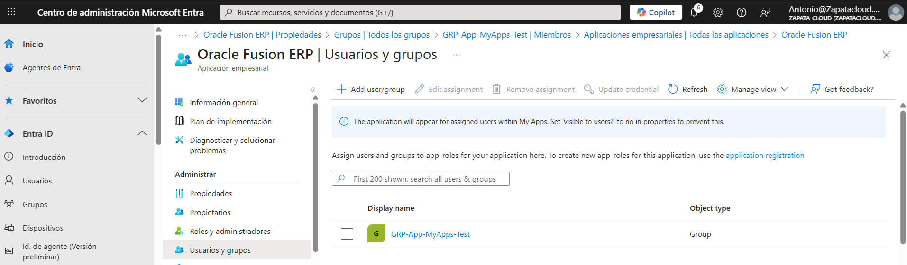
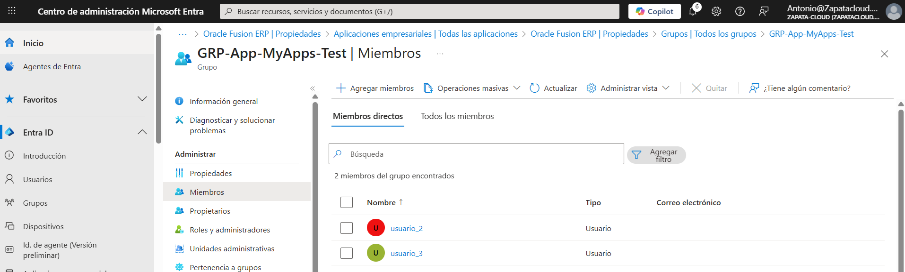
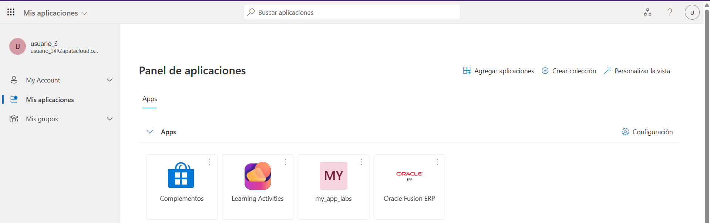
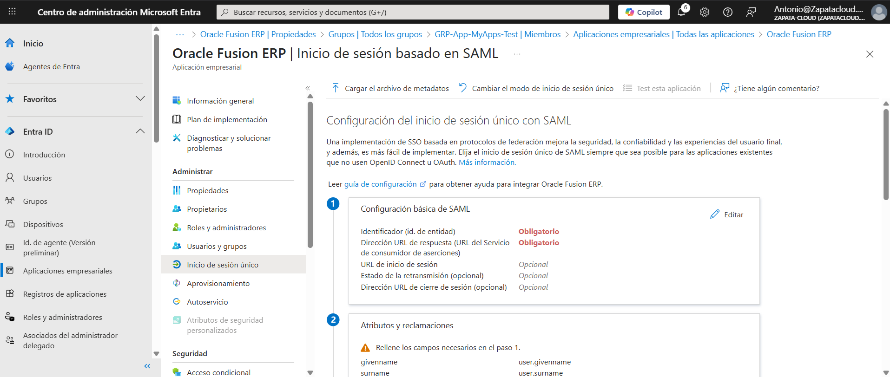

# 🧪 Lab 10: Enterprise Applications & SSO (Gallery Apps)

**Repo:** Azure-Lab-10-EnterpriseApps-SSO

---

## 🎯 Objetivo
Centralizar y gobernar el acceso a aplicaciones SaaS externas mediante **Enterprise Applications** en Microsoft Entra ID, usando **asignación por grupos** y configuración inicial de **Single Sign-On (SSO)**.

Este laboratorio se centra en el **control de acceso de usuarios** y la **experiencia de inicio de sesión**, no en la creación de identidades de aplicación (App registrations).

---

## 🛠️ Tareas realizadas

### Parte A — Alta de aplicación desde galería
1. Alta de una aplicación SaaS desde la galería (**Oracle Fusion ERP**).
2. Revisión de propiedades de la aplicación empresarial.
3. Validación de parámetros básicos (Id. de aplicación, Id. de objeto, URL de acceso de usuario).

---

### Parte B — Control de acceso por identidad (grupos)
4. Creación de un **grupo de seguridad** para control de acceso.
5. Asignación de la aplicación empresarial al grupo.
6. Inclusión de un **usuario estándar** en el grupo.
7. Verificación de que el acceso se concede **por pertenencia al grupo**, no por asignación directa.

---

### Parte C — Visibilidad y experiencia de usuario (My Apps)
8. Configuración de la opción **“Visible para los usuarios = Sí”**.
9. Validación del comportamiento de aplicaciones de galería frente a aplicaciones no de galería.
10. Acceso del usuario al portal **My Apps** y comprobación de visibilidad del tile de la aplicación.

> Nota: Algunas aplicaciones de galería no aparecen en My Apps si no existe una experiencia de inicio de sesión válida o completa, incluso estando asignadas y visibles.

---

### Parte D — Introducción a SSO (SAML)
11. Acceso a la sección **Inicio de sesión único** de la aplicación.
12. Revisión de la configuración SAML (Entity ID, Reply URL, Sign-on URL).
13. Identificación de los parámetros necesarios para una integración completa con el proveedor SaaS.

> Alcance del laboratorio: configuración inicial y revisión de SSO.  
> La integración completa requiere configuración adicional en el proveedor (Oracle) y queda fuera del alcance de este lab.

---

## 📸 Evidencias

### 01 — Aplicación creada desde galería (Enterprise Applications)
 

### 02 — Propiedades de la aplicación (Visible para los usuarios / Asignación requerida)
 

### 03 — Aplicación asignada a grupo (Users and groups)
 

### 04 — Usuario dentro del grupo (Group membership)
 

### 05 — My Apps (vista del usuario estándar)
 

### 06 — Configuración inicial de SSO (SAML)
 

---

## ✅ Checklist de verificación
- [x] Aplicación creada desde galería
- [x] Asignación por grupo de seguridad
- [x] Usuario obtiene acceso por pertenencia al grupo
- [x] Aplicación visible en My Apps
- [x] Configuración inicial de SSO (SAML) revisada

---

## 🗣️ Qué le diría al cliente / entrevista
“Centralizo el acceso a aplicaciones SaaS externas mediante Enterprise Applications, asignando acceso por grupos y aplicando SSO. Esto permite aplicar MFA y Conditional Access antes del acceso a servicios externos, mejorando el control, la trazabilidad y la seguridad.”
